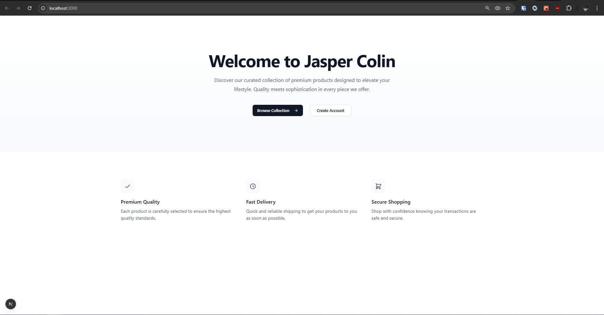
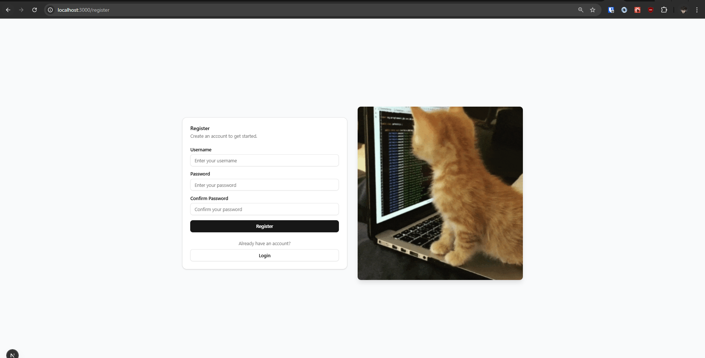
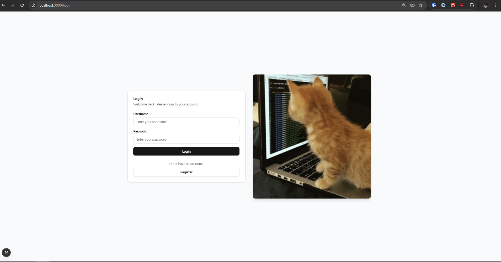
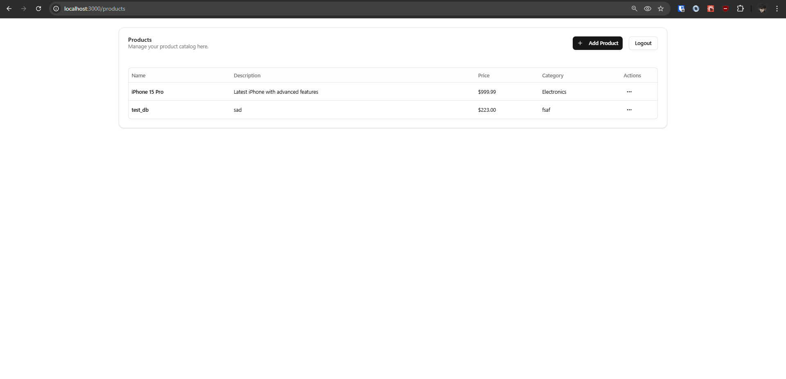
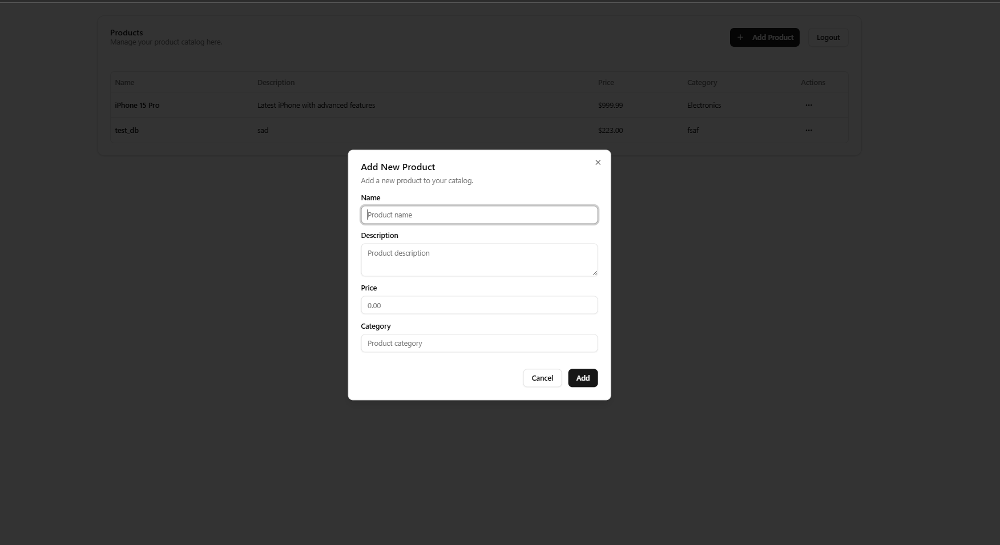

# Jasper Colin Crud App

A full-stack application built with Next.js frontend and Node.js/Express.js backend with MongoDB database, featuring user authentication and product management.

## Features

- User authentication with JWT
- Product management (CRUD operations)
- Protected routes
- Rate limiting
- Node clustering
- Auth guards
- Responsive UI

## Prerequisites

- Node.js (v14 or higher)
- MongoDB installed and running locally
- npm or yarn package manager

## Project Structure

```
.
├── frontend/         # Next.js frontend application
└── backend/         # Express.js backend application
```

## Getting Started

### Backend Setup

1. Navigate to the backend directory:
   ```bash
   cd backend
   ```

2. Install dependencies:
   ```bash
   npm install
   ```

3. Create a `.env` file in the backend directory with the following variables:
   ```
   PORT=5000
   MONGODB_URI=mongodb://localhost:27017/product_management
   JWT_SECRET=your_jwt_secret_here
   ```

4. Start the backend server:
   ```bash
   # Development mode
   npm run dev

   # Production mode with clustering
   npm start
   ```

The backend server will start on http://localhost:5000

### Frontend Setup

1. Navigate to the frontend directory:
   ```bash
   cd frontend
   ```

2. Install dependencies:
   ```bash
   npm install
   ```

3. Create a `.env.local` file in the frontend directory:
   ```
   NEXT_PUBLIC_API_URL=http://localhost:5000/api
   ```

4. Start the frontend development server:
   ```bash
   npm run dev
   ```

The frontend application will be available at http://localhost:3000

## Requirements Checklist

### Task 1: Environment Setup ✅
- [x] Next.js project created
- [x] Express.js server setup
- [x] MongoDB connection with Mongoose

### Task 2: CRUD Application

Backend ✅
- [x] POST /api/products (Create)
- [x] GET /api/products (Read all)
- [x] GET /api/products/:id (Read single)
- [x] PUT /api/products/:id (Update)
- [x] DELETE /api/products/:id (Delete)
- [x] API Rate Limiting

Frontend ✅
- [x] Product list display
- [x] Add product form
- [x] Edit product functionality
- [x] Delete product functionality

### Task 3: Authentication & Authorization

Backend ✅
- [x] Node Clustering implemented
- [x] JWT authentication
- [x] POST /api/auth/register
- [x] POST /api/auth/login
- [x] Protected route middleware

Frontend ✅
- [x] Auth Guard implementation
- [x] Login form
- [x] Registration form
- [x] JWT storage in cookies
- [x] Protected route handling

### Task 4: FastAPI Backend

- [x] Implemented FastAPI backend

## API Endpoints

### Authentication
- POST /api/auth/register - Register new user
- POST /api/auth/login - Login user

### Products (Protected Routes)
- GET /api/products - Get all products
- GET /api/products/:id - Get single product
- POST /api/products - Create product
- PUT /api/products/:id - Update product
- DELETE /api/products/:id - Delete product

## Security Features

- JWT token authentication
- Protected API routes
- Rate limiting
- Secure password hashing
- HTTP-only cookies for token storage

## Frontend UI Examples

- Base


- Register


- Login


- Products


- Add/Edit Product


